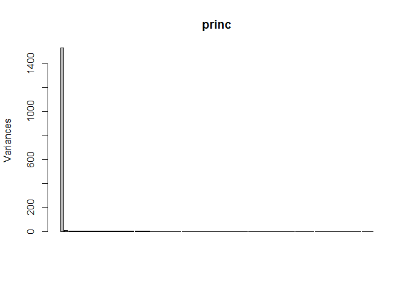
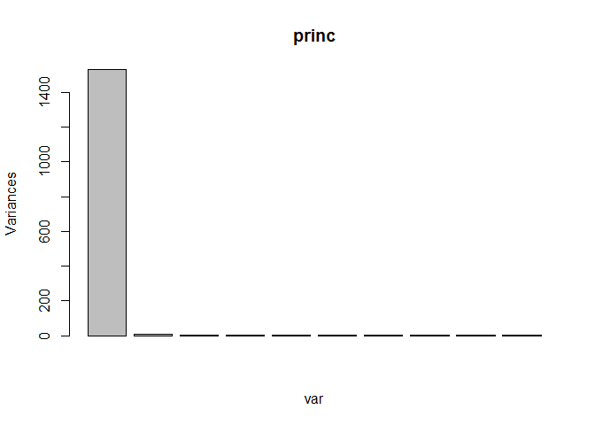
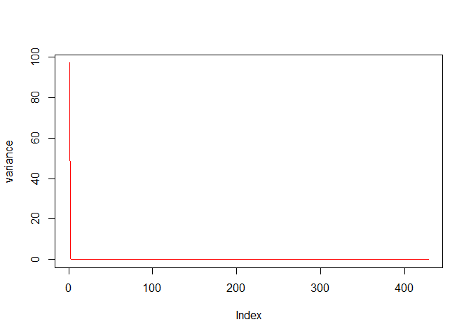
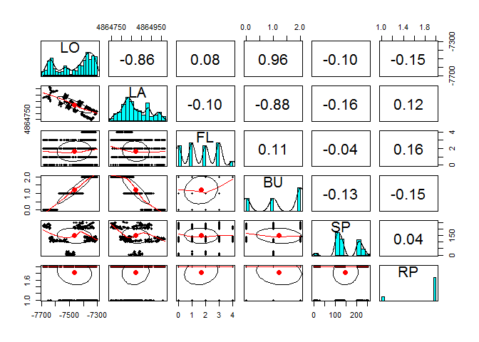
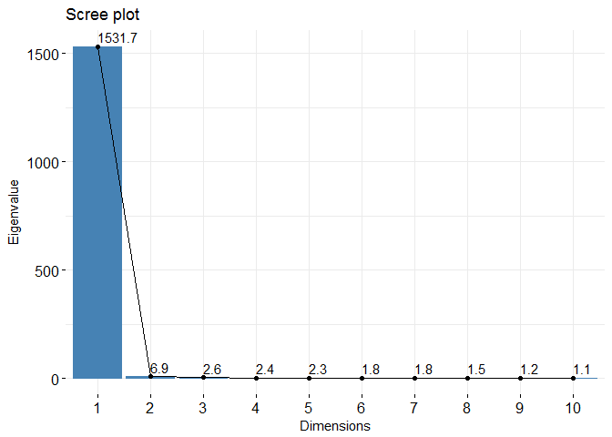

Indoor localization through Wifi footprint Script
================

This time I will split my coding in 3 files: + Preprocessing + Longitud and Latitude models + Other location variables models

Longitud and latitude are the only values I need in order to locate someone. However I wanted also to see how accurate the prediction on other variables could have been

``` r
setwd("C:/Users/Raquel/Dropbox/GitHub/Projects/Indoor localization Wifi Footprint")
```

Import files
============

``` r
library(readr)
trainingData <- read.csv("trainingData.csv", 
                         check.names=TRUE)
validationData <- read.csv("validationData.csv", 
                           check.names=TRUE)
```

PART 1: DATA EXPLORATION
========================

Descriptive analysis
====================

Some stats to look into

``` r
Stats1 <- data.frame(
  Min = apply(trainingData, 2, min), # minimum
  Q1 = apply(trainingData, 2, quantile, 1/4), # First quartile
  Med = apply(trainingData, 2, median), # median
  Mean = apply(trainingData, 2, mean), # mean
  Q3 = apply(trainingData, 2, quantile, 3/4), # Third quartile
  Max = apply(trainingData, 2, max) # Maximum
)
head(Stats1,5)
```

    ##        Min  Q1 Med      Mean  Q3 Max
    ## WAP001 -97 100 100  99.82364 100 100
    ## WAP002 -90 100 100  99.82094 100 100
    ## WAP003 100 100 100 100.00000 100 100
    ## WAP004 100 100 100 100.00000 100 100
    ## WAP005 -97 100 100  99.61373 100 100

``` r
Stats2 <- data.frame(
  Min = apply(validationData, 2, min), # minimum
  Q1 = apply(validationData, 2, quantile, 1/4), # First quartile
  Med = apply(validationData, 2, median), # median
  Mean = apply(validationData, 2, mean), # mean
  Q3 = apply(validationData, 2, quantile, 3/4), # Third quartile
  Max = apply(validationData, 2, max) # Maximum
)
```

There are some features that by common sense will not be useful for our prediction. I will mirror all my pre-processing in the training set in my validation data.

``` r
trainingData$TIMESTAMP <- NULL
trainingData$USERID <- NULL
trainingData$PHONEID <- NULL
#
validationData$TIMESTAMP <- NULL
validationData$USERID <- NULL
validationData$PHONEID <- NULL
```

I would create a features data frame with only the WAP values

``` r
trainingData1 <- trainingData[,1:520]
trainingData1 <- apply(trainingData1, 2, as.numeric)
trainingData2 <- trainingData[,521:526]
#
validationData1 <- validationData[,1:520]
validationData1 <- apply(validationData1, 2, as.numeric)
validationData2 <- validationData[,521:526]
```

NearZeroVar
===========

Values with Variance near zero are only introducing noise in our model and there are also not useful for our model.

``` r
library(stats)
library(caret)
nzv <- nearZeroVar(trainingData1, 
                   saveMetrics = TRUE)
head(nzv,5)
```

    ##        freqRatio percentUnique zeroVar  nzv
    ## WAP001  2489.875     0.0300948   FALSE TRUE
    ## WAP002  1991.800     0.0150474   FALSE TRUE
    ## WAP003     0.000     0.0050158    TRUE TRUE
    ## WAP004     0.000     0.0050158    TRUE TRUE
    ## WAP005  1421.214     0.0501580   FALSE TRUE

how many Wap features do we have?

``` r
dim(trainingData1)
```

    ## [1] 19937   520

I am going to use the value from the WAPS with Null values (=100 in our data set) as a cut off value.

``` r
x <- 0.0100316  #that is the value of the variance from which we will discriminate. 
```

``` r
dim(nzv[nzv$percentUnique > x,])
```

    ## [1] 428   4

I select the WAPs that fulfill the requirement

``` r
colz <- c(rownames(nzv[nzv$percentUnique > x,]))
```

and then eliminate them in both data sets:

``` r
new_trainingData1 <- 
  as.data.frame(trainingData1[,colz])
new_validationData1 <-
  as.data.frame(validationData1[,colz])
remove(x)
remove(colz)
remove(nzv)
```

I will check if both data sets had the same transformation:

``` r
all.equal(colnames(new_trainingData1), 
          colnames(new_validationData1))#TRUE
```

    ## [1] TRUE

``` r
dim(new_trainingData1)#428 columns
```

    ## [1] 19937   428

``` r
dim(new_validationData1)#428 colums
```

    ## [1] 1111  428

Scaling
=======

I apply the following function -min/max-min

``` r
normalize <- function(x) { return( (x +104) / (0 + 104) ) }
```

``` r
pmatrix1 <- as.data.frame(apply(new_trainingData1, 
                                2, 
                                normalize))
pmatrix2 <- as.data.frame(apply(new_validationData1, 
                                2, normalize))
```

Feature Reduction (with PCA)
============================

Considering the large amount of features, I want to reduce the number of them. I also need to check the correlation between them in order to erase the columns that give the same information as it will impact wrongly in our model. One way to do it reducing at the same time the correlation between the features is applying Principle component Analysis.

``` r
library(FactoMineR)
library(doParallel)#to squeeze my computer

registerDoParallel(core = 4)
princ <- prcomp(pmatrix1, scale=FALSE, center = FALSE)
```

print(princ) \#Screeplot

``` r
screeplot(princ,npcs = 80)
```

 \#Variance Let's start plotting it.

``` r
plot(princ, xlab = "var")
```

 How much of the Total Variance explains each PCA?

``` r
variance <- princ$sdev^2/sum(princ$sdev^2)*100
plot(variance, type = "line", col = "red")
```

 As a rule of a thumb features explaining 80% of the variance are enough to build a good model. In our new data set our 92 first PCA's fulfill that requirement.

As I mention before I need to apply same transformation to my validation set.

``` r
pmatrix1 <- as.matrix(pmatrix1)
pmatrix2 <- as.matrix(pmatrix2)
```

``` r
rotation <- princ$rotation
brandnew_trainingData1 <- pmatrix1 %*% rotation
brandnew_validationData1 <- pmatrix2 %*% rotation
```

Did I do it right?

``` r
all.equal(brandnew_trainingData1, princ$x)
```

    ## [1] TRUE

I am going to create a new data set with the selected PCA's. I will also rename my classes for better typing.

``` r
colnames(trainingData2) <-  c("LO", "LA", "FL", "BU", "SP", "RP")
colnames(validationData2) <- c("LO", "LA", "FL", "BU", "SP", "RP")
comp <- 92
new_trainingSet <- 
  as.data.frame(cbind(brandnew_trainingData1[,1:comp], 
                      trainingData2))
#
new_validationSet <- 
  as.data.frame(cbind(brandnew_validationData1[,1:comp], 
                      validationData2))
```

Save the new data
=================

I am going to save this new files so I can use lattet without running all the script.

``` r
write.csv(new_trainingSet, "new_training.csv", 
          row.names = FALSE)
write.csv(new_validationSet, "new_validation.csv", 
          row.names = FALSE)
```

Data Visualization
==================

``` r
library(ggplot2)
```

Plot 1- Building ID
-------------------

``` r
ggplot(trainingData, aes(LONGITUDE, 
                         LATITUDE), 
       colour = BUILDINGID) +
  ggtitle("Building ID - Vs Longitud $Latitude") +
  geom_hex() +
  theme(legend.position = "bottom")
```

 I can see the shapes of the buldings. Also I can recognise when looking in Google map, which building is. It is part of the University Campus from \[Universitat Jaume I\] ("<https://www.google.es/maps/place/Universitat+Jaume+I/@39.9929222,-0.0676806,17z/data>=!4m5!3m4!1s0xd5ffe0fca9b5147:0x1368bf53b3a7fb3f!8m2!3d39.9945711!4d-0.0689003?hl=es"),in Castelló, Spain. Not surprisingly, is the University in which attend this data set owners. The plot shows the coherence of the data collected. It seems there is no mistake in its collection.

I have drawn its shape on the map.

\[UJI Buildings\]\[01\_Preprocessing\_files/figure-markdown\_github/gmap.png\]

Plot 2 - Relative Position
--------------------------

``` r
ggplot(trainingData, aes(LONGITUDE, 
                         LATITUDE)) +
  geom_point(colour = trainingData$RELATIVEPOSITION) +
  ggtitle("Relative Position") 
```


Plot 3 - Space Id
-----------------

With this plot I want to know if the Space ID is shared with other buildings or is an unique name across buildings.

``` r
ggplot(trainingData, aes(as.character(BUILDINGID), 
                         as.character(SPACEID))) +
    geom_point()+
    xlab("BUILDING #")+
    ylab("SPACE ID")+
    ggtitle("Space ID vs Building")
```

 Space is not unique!

Plot 4 - Longitude, latitude and Floor
--------------------------------------

``` r
library(scatterplot3d)
scatterplot3d( x= trainingData$LATITUDE, 
               y= trainingData$LONGITUDE,
               z = trainingData$FLOOR, 
               type = "p",
               color = trainingData$SPACEID,
               pch = 20)
```


Basic Exploration
=================

Missing values
--------------

``` r
library(Amelia)
missmap(trainingData)#there is no missing values
```


``` r
missmap(validationData)#there is no missing values
```


Plot 5 - Correlation Matrices
-----------------------------

``` r
library(GGally)
corr1 <- cor(trainingData1)
corr2 <- trainingData2[,]
ggcorr(corr1, label = TRUE)
```


``` r
ggcorr(corr2, label = TRUE)
```


``` r
library(corrplot)
corrplot(corr1, method = "square", type ="upper")
```


``` r
#
ggpairs(corr2)
```


``` r
library(psych)
pairs.panels(trainingData2)
```



Visualizing PCA
===============

Plot 6 - % of the Variance
--------------------------

With PCA we decided that 92 components were explaining most of the variance. Now we can see it in a plot.

``` r
library(factoextra)
fviz_eig(princ, addlabels = TRUE, 
         linecolor = "chocolate1", 
         barfill="white", 
         barcolor ="darkblue")
```


Plot 7 - Factor map PCA colored
-------------------------------

``` r
fviz_pca_var(princ, col.var="cos2") +
  scale_color_gradient2(low="white", 
                        mid="blue", 
                        high="red", 
                        midpoint=0.5) + theme_minimal()
```


Plot 8 - Eigenvalue
-------------------

``` r
fviz_eig(princ, choice = "eigenvalue", 
         addlabels=TRUE)
```


