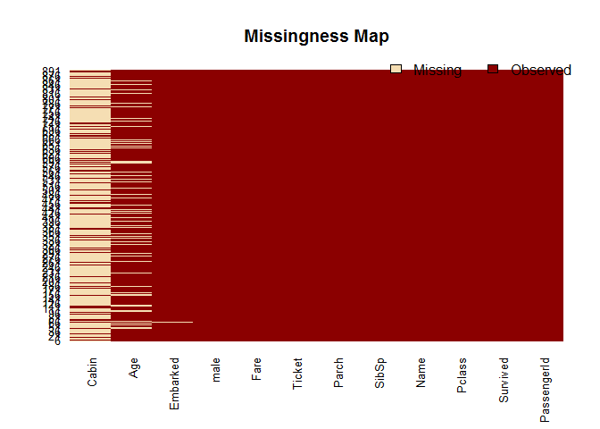
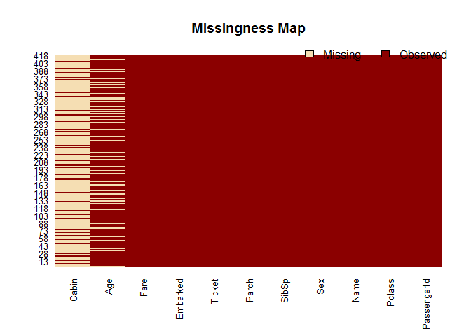
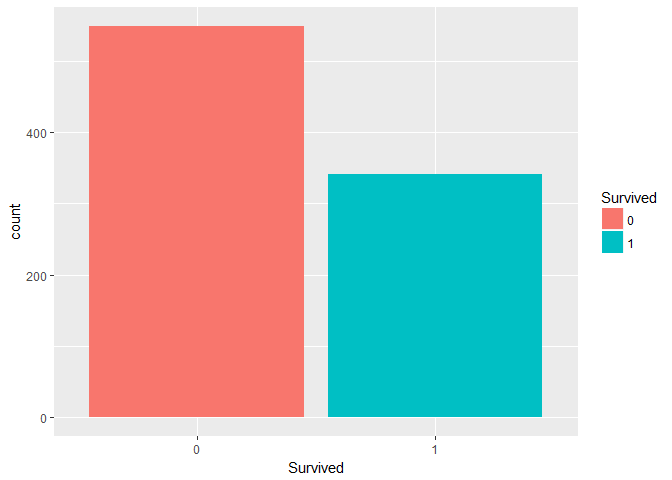
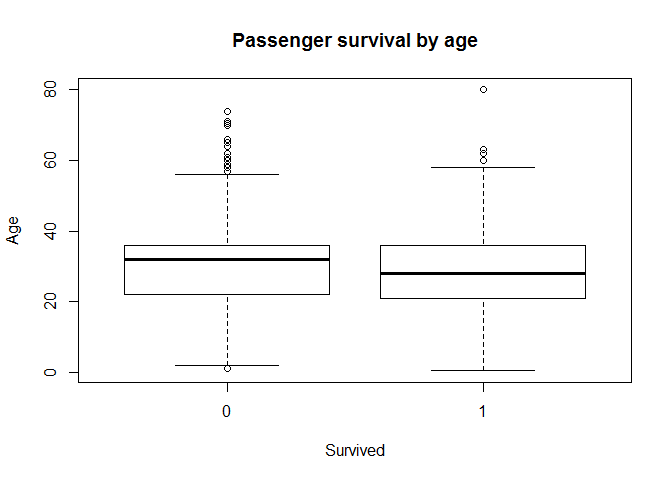
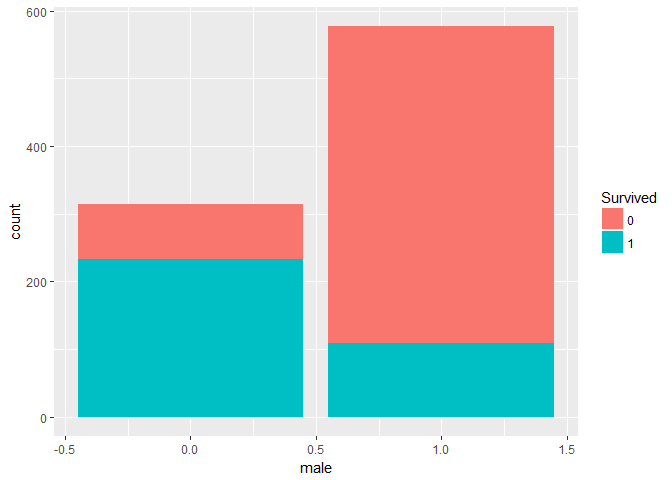
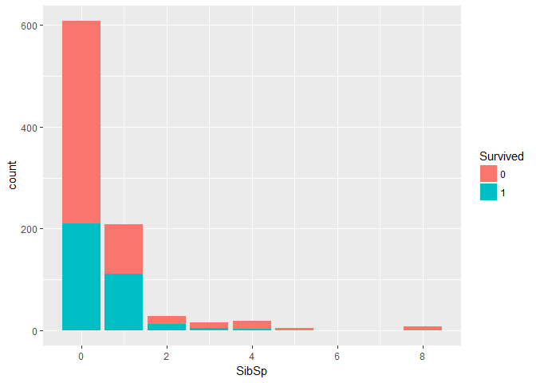
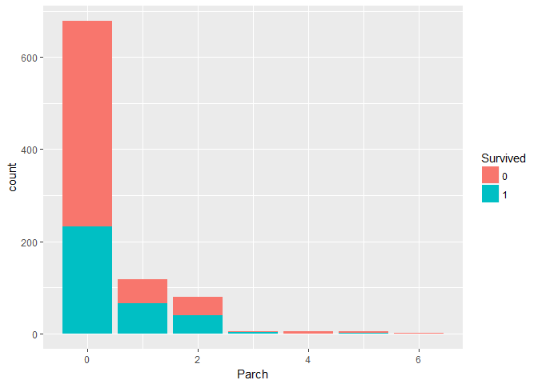
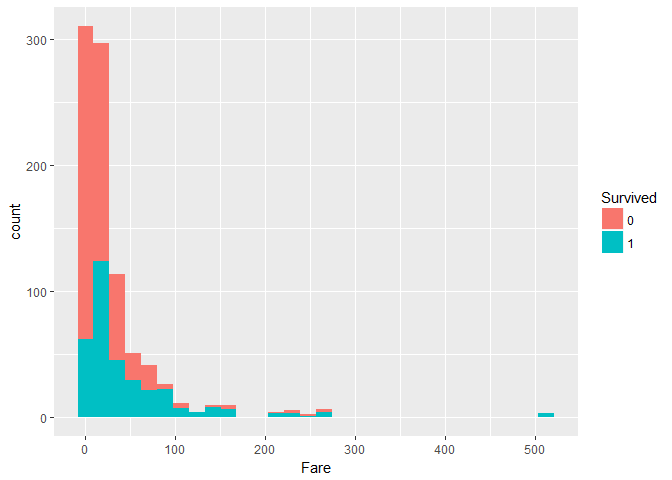

Titanic Survival prediction Script
================

Libraries needed to run the script

``` r
library(corrplot) #for correlation matrix
```

``` r
train <- read.csv("train.csv", na.strings = c("NA", "NULL", ""))
test <- read.csv("test.csv", na.strings = c("NA", "NULL", ""))
head(train)
```

    ##   PassengerId Survived Pclass
    ## 1           1        0      3
    ## 2           2        1      1
    ## 3           3        1      3
    ## 4           4        1      1
    ## 5           5        0      3
    ## 6           6        0      3
    ##                                                  Name    Sex Age SibSp
    ## 1                             Braund, Mr. Owen Harris   male  22     1
    ## 2 Cumings, Mrs. John Bradley (Florence Briggs Thayer) female  38     1
    ## 3                              Heikkinen, Miss. Laina female  26     0
    ## 4        Futrelle, Mrs. Jacques Heath (Lily May Peel) female  35     1
    ## 5                            Allen, Mr. William Henry   male  35     0
    ## 6                                    Moran, Mr. James   male  NA     0
    ##   Parch           Ticket    Fare Cabin Embarked
    ## 1     0        A/5 21171  7.2500  <NA>        S
    ## 2     0         PC 17599 71.2833   C85        C
    ## 3     0 STON/O2. 3101282  7.9250  <NA>        S
    ## 4     0           113803 53.1000  C123        S
    ## 5     0           373450  8.0500  <NA>        S
    ## 6     0           330877  8.4583  <NA>        Q

``` r
str(train)
```

    ## 'data.frame':    891 obs. of  12 variables:
    ##  $ PassengerId: int  1 2 3 4 5 6 7 8 9 10 ...
    ##  $ Survived   : int  0 1 1 1 0 0 0 0 1 1 ...
    ##  $ Pclass     : int  3 1 3 1 3 3 1 3 3 2 ...
    ##  $ Name       : Factor w/ 891 levels "Abbing, Mr. Anthony",..: 109 191 358 277 16 559 520 629 417 581 ...
    ##  $ Sex        : Factor w/ 2 levels "female","male": 2 1 1 1 2 2 2 2 1 1 ...
    ##  $ Age        : num  22 38 26 35 35 NA 54 2 27 14 ...
    ##  $ SibSp      : int  1 1 0 1 0 0 0 3 0 1 ...
    ##  $ Parch      : int  0 0 0 0 0 0 0 1 2 0 ...
    ##  $ Ticket     : Factor w/ 681 levels "110152","110413",..: 524 597 670 50 473 276 86 396 345 133 ...
    ##  $ Fare       : num  7.25 71.28 7.92 53.1 8.05 ...
    ##  $ Cabin      : Factor w/ 147 levels "A10","A14","A16",..: NA 82 NA 56 NA NA 130 NA NA NA ...
    ##  $ Embarked   : Factor w/ 3 levels "C","Q","S": 3 1 3 3 3 2 3 3 3 1 ...

``` r
colnames(train)
```

    ##  [1] "PassengerId" "Survived"    "Pclass"      "Name"        "Sex"        
    ##  [6] "Age"         "SibSp"       "Parch"       "Ticket"      "Fare"       
    ## [11] "Cabin"       "Embarked"

``` r
colnames(test)
```

    ##  [1] "PassengerId" "Pclass"      "Name"        "Sex"         "Age"        
    ##  [6] "SibSp"       "Parch"       "Ticket"      "Fare"        "Cabin"      
    ## [11] "Embarked"

Some Preprocessing
------------------

### Sex

Convert Sex attribute to boolean

``` r
train$male <- as.integer(ifelse(train$Sex == "male", 1, 0))
train$Sex <- NULL
```

### Survived

Transform to factor:

``` r
train$Survived <- as.factor(train$Survived)
```

### Missing values

``` r
library(Amelia)
```

    ## Loading required package: Rcpp

    ## ## 
    ## ## Amelia II: Multiple Imputation
    ## ## (Version 1.7.4, built: 2015-12-05)
    ## ## Copyright (C) 2005-2017 James Honaker, Gary King and Matthew Blackwell
    ## ## Refer to http://gking.harvard.edu/amelia/ for more information
    ## ##

``` r
missmap(train)
```



``` r
missmap(test)
```



``` r
is.na(train$Age)#index of MV
```

    ##   [1] FALSE FALSE FALSE FALSE FALSE  TRUE FALSE FALSE FALSE FALSE FALSE
    ##  [12] FALSE FALSE FALSE FALSE FALSE FALSE  TRUE FALSE  TRUE FALSE FALSE
    ##  [23] FALSE FALSE FALSE FALSE  TRUE FALSE  TRUE  TRUE FALSE  TRUE  TRUE
    ##  [34] FALSE FALSE FALSE  TRUE FALSE FALSE FALSE FALSE FALSE  TRUE FALSE
    ##  [45] FALSE  TRUE  TRUE  TRUE  TRUE FALSE FALSE FALSE FALSE FALSE FALSE
    ##  [56]  TRUE FALSE FALSE FALSE FALSE FALSE FALSE FALSE FALSE  TRUE  TRUE
    ##  [67] FALSE FALSE FALSE FALSE FALSE FALSE FALSE FALSE FALSE FALSE  TRUE
    ##  [78]  TRUE FALSE FALSE FALSE FALSE  TRUE FALSE FALSE FALSE FALSE  TRUE
    ##  [89] FALSE FALSE FALSE FALSE FALSE FALSE FALSE  TRUE FALSE FALSE FALSE
    ## [100] FALSE FALSE  TRUE FALSE FALSE FALSE FALSE FALSE  TRUE FALSE  TRUE
    ## [111] FALSE FALSE FALSE FALSE FALSE FALSE FALSE FALSE FALSE FALSE FALSE
    ## [122]  TRUE FALSE FALSE FALSE FALSE  TRUE FALSE  TRUE FALSE FALSE FALSE
    ## [133] FALSE FALSE FALSE FALSE FALSE FALSE FALSE FALSE  TRUE FALSE FALSE
    ## [144] FALSE FALSE FALSE FALSE FALSE FALSE FALSE FALSE FALSE FALSE FALSE
    ## [155]  TRUE FALSE FALSE FALSE  TRUE  TRUE FALSE FALSE FALSE FALSE FALSE
    ## [166] FALSE  TRUE FALSE  TRUE FALSE FALSE FALSE FALSE FALSE FALSE FALSE
    ## [177]  TRUE FALSE FALSE FALSE  TRUE  TRUE FALSE FALSE FALSE  TRUE  TRUE
    ## [188] FALSE FALSE FALSE FALSE FALSE FALSE FALSE FALSE FALSE  TRUE FALSE
    ## [199]  TRUE FALSE FALSE  TRUE FALSE FALSE FALSE FALSE FALSE FALSE FALSE
    ## [210] FALSE FALSE FALSE FALSE FALSE  TRUE FALSE FALSE FALSE FALSE FALSE
    ## [221] FALSE FALSE FALSE  TRUE FALSE FALSE FALSE FALSE FALSE  TRUE FALSE
    ## [232] FALSE FALSE FALSE FALSE  TRUE FALSE FALSE FALSE FALSE  TRUE  TRUE
    ## [243] FALSE FALSE FALSE FALSE FALSE FALSE FALSE FALSE  TRUE FALSE FALSE
    ## [254] FALSE FALSE FALSE  TRUE FALSE FALSE FALSE  TRUE FALSE FALSE FALSE
    ## [265]  TRUE FALSE FALSE FALSE FALSE FALSE  TRUE FALSE FALSE FALSE  TRUE
    ## [276] FALSE FALSE  TRUE FALSE FALSE FALSE FALSE FALSE FALSE  TRUE FALSE
    ## [287] FALSE FALSE FALSE FALSE FALSE FALSE FALSE FALSE FALSE  TRUE FALSE
    ## [298] FALSE  TRUE FALSE  TRUE  TRUE FALSE  TRUE  TRUE FALSE  TRUE FALSE
    ## [309] FALSE FALSE FALSE FALSE FALSE FALSE FALSE FALSE FALSE FALSE FALSE
    ## [320] FALSE FALSE FALSE FALSE FALSE  TRUE FALSE FALSE FALSE FALSE FALSE
    ## [331]  TRUE FALSE FALSE FALSE  TRUE  TRUE FALSE FALSE FALSE FALSE FALSE
    ## [342] FALSE FALSE FALSE FALSE FALSE FALSE  TRUE FALSE FALSE FALSE  TRUE
    ## [353] FALSE FALSE  TRUE FALSE FALSE FALSE  TRUE  TRUE FALSE FALSE FALSE
    ## [364] FALSE  TRUE FALSE FALSE  TRUE  TRUE FALSE FALSE FALSE FALSE FALSE
    ## [375] FALSE  TRUE FALSE FALSE FALSE FALSE FALSE FALSE FALSE FALSE  TRUE
    ## [386] FALSE FALSE FALSE  TRUE FALSE FALSE FALSE FALSE FALSE FALSE FALSE
    ## [397] FALSE FALSE FALSE FALSE FALSE FALSE FALSE FALSE FALSE FALSE FALSE
    ## [408] FALSE FALSE  TRUE  TRUE  TRUE FALSE  TRUE FALSE  TRUE FALSE FALSE
    ## [419] FALSE FALSE  TRUE FALSE FALSE FALSE FALSE  TRUE FALSE FALSE  TRUE
    ## [430] FALSE FALSE  TRUE FALSE FALSE FALSE FALSE FALSE FALSE FALSE FALSE
    ## [441] FALSE FALSE FALSE FALSE  TRUE FALSE FALSE FALSE FALSE FALSE FALSE
    ## [452]  TRUE FALSE FALSE  TRUE FALSE FALSE  TRUE FALSE  TRUE FALSE FALSE
    ## [463] FALSE FALSE  TRUE FALSE  TRUE FALSE  TRUE FALSE  TRUE FALSE FALSE
    ## [474] FALSE FALSE  TRUE FALSE FALSE FALSE FALSE FALSE  TRUE FALSE FALSE
    ## [485] FALSE  TRUE FALSE FALSE FALSE FALSE  TRUE FALSE FALSE FALSE FALSE
    ## [496]  TRUE FALSE  TRUE FALSE FALSE FALSE FALSE  TRUE FALSE FALSE FALSE
    ## [507] FALSE  TRUE FALSE FALSE FALSE  TRUE FALSE FALSE FALSE FALSE FALSE
    ## [518]  TRUE FALSE FALSE FALSE FALSE  TRUE FALSE  TRUE FALSE FALSE  TRUE
    ## [529] FALSE FALSE FALSE  TRUE FALSE  TRUE FALSE FALSE FALSE FALSE  TRUE
    ## [540] FALSE FALSE FALSE FALSE FALSE FALSE FALSE FALSE  TRUE FALSE FALSE
    ## [551] FALSE FALSE  TRUE FALSE FALSE FALSE FALSE  TRUE FALSE FALSE  TRUE
    ## [562] FALSE FALSE  TRUE  TRUE FALSE FALSE FALSE  TRUE FALSE FALSE FALSE
    ## [573] FALSE  TRUE FALSE FALSE FALSE FALSE  TRUE FALSE FALSE FALSE FALSE
    ## [584] FALSE  TRUE FALSE FALSE FALSE FALSE  TRUE FALSE FALSE FALSE  TRUE
    ## [595] FALSE FALSE  TRUE FALSE  TRUE FALSE FALSE  TRUE  TRUE FALSE FALSE
    ## [606] FALSE FALSE FALSE FALSE FALSE FALSE  TRUE  TRUE  TRUE FALSE FALSE
    ## [617] FALSE FALSE FALSE FALSE FALSE FALSE FALSE FALSE FALSE FALSE FALSE
    ## [628] FALSE FALSE  TRUE FALSE FALSE FALSE  TRUE FALSE FALSE FALSE FALSE
    ## [639] FALSE  TRUE FALSE FALSE FALSE  TRUE FALSE FALSE FALSE FALSE  TRUE
    ## [650] FALSE  TRUE FALSE FALSE  TRUE FALSE FALSE  TRUE FALSE FALSE FALSE
    ## [661] FALSE FALSE FALSE FALSE FALSE FALSE FALSE  TRUE FALSE  TRUE FALSE
    ## [672] FALSE FALSE FALSE  TRUE FALSE FALSE FALSE FALSE FALSE  TRUE FALSE
    ## [683] FALSE FALSE FALSE FALSE FALSE FALSE FALSE FALSE FALSE FALSE  TRUE
    ## [694] FALSE FALSE FALSE FALSE  TRUE FALSE FALSE FALSE FALSE FALSE FALSE
    ## [705] FALSE FALSE FALSE FALSE FALSE  TRUE FALSE  TRUE FALSE FALSE FALSE
    ## [716] FALSE FALSE FALSE  TRUE FALSE FALSE FALSE FALSE FALSE FALSE FALSE
    ## [727] FALSE  TRUE FALSE FALSE FALSE FALSE  TRUE FALSE FALSE FALSE FALSE
    ## [738] FALSE  TRUE  TRUE  TRUE FALSE FALSE FALSE FALSE FALSE FALSE FALSE
    ## [749] FALSE FALSE FALSE FALSE FALSE FALSE FALSE FALSE FALSE FALSE FALSE
    ## [760] FALSE  TRUE FALSE FALSE FALSE FALSE FALSE  TRUE FALSE  TRUE FALSE
    ## [771] FALSE FALSE FALSE  TRUE FALSE FALSE  TRUE FALSE  TRUE FALSE FALSE
    ## [782] FALSE FALSE  TRUE FALSE FALSE FALSE FALSE FALSE FALSE  TRUE FALSE
    ## [793]  TRUE  TRUE FALSE FALSE FALSE FALSE FALSE FALSE FALSE FALSE FALSE
    ## [804] FALSE FALSE FALSE FALSE FALSE FALSE FALSE FALSE FALSE FALSE FALSE
    ## [815] FALSE  TRUE FALSE FALSE FALSE FALSE FALSE FALSE FALSE FALSE FALSE
    ## [826]  TRUE  TRUE FALSE  TRUE FALSE FALSE FALSE  TRUE FALSE FALSE FALSE
    ## [837] FALSE  TRUE FALSE  TRUE FALSE FALSE FALSE FALSE FALSE FALSE  TRUE
    ## [848] FALSE FALSE  TRUE FALSE FALSE FALSE FALSE FALSE FALSE FALSE FALSE
    ## [859] FALSE  TRUE FALSE FALSE FALSE  TRUE FALSE FALSE FALSE FALSE  TRUE
    ## [870] FALSE FALSE FALSE FALSE FALSE FALSE FALSE FALSE FALSE  TRUE FALSE
    ## [881] FALSE FALSE FALSE FALSE FALSE FALSE FALSE FALSE  TRUE FALSE FALSE

``` r
sum(is.na(train$Age) == TRUE) #177
```

    ## [1] 177

``` r
sum(is.na(train$Age) == TRUE)/length(train$Age)#in%  0.1986532
```

    ## [1] 0.1986532

#### Embarked

``` r
table(train$Embarked, useNA = "always")
```

    ## 
    ##    C    Q    S <NA> 
    ##  168   77  644    2

I will assign the value to the port with more passengers, *Southampton*

``` r
train$Embarked[which(is.na(train$Embarked))] <- "S"
```

#### Age

We are going to check the titles in the Name feature. We assume that in those years people had more clusterized styles of life, therefore got married, had children at similar ages.

``` r
train$Name <- as.character(train$Name)
table_words <- table(unlist(strsplit(train$Name, "\\s+")))
sort(table_words [grep("\\.", names(table_words))], decreasing = TRUE)
```

    ## 
    ##       Mr.     Miss.      Mrs.   Master.       Dr.      Rev.      Col. 
    ##       517       182       125        40         7         6         2 
    ##    Major.     Mlle.     Capt. Countess.      Don. Jonkheer.        L. 
    ##         2         2         1         1         1         1         1 
    ##     Lady.      Mme.       Ms.      Sir. 
    ##         1         1         1         1

We need to find first the missing values that need to be filled up.

``` r
library(stringr)
tab <- cbind(train$Age, str_match(train$Name, "[a-zA-Z]+\\."))
table(tab[is.na(tab[,1]),2])
```

    ## 
    ##     Dr. Master.   Miss.     Mr.    Mrs. 
    ##       1       4      36     119      17

For the title containing a missing values, I will impute the mean of the value for each title group.

``` r
mean_mr <- mean(train$Age[grepl(" Mr\\.", train$Name) & !is.na(train$Age)])
mean_mrs <- mean(train$Age[grepl(" Mrs\\.", train$Name) & !is.na(train$Age)])
mean_dr <- mean(train$Age[grepl(" Dr\\.", train$Name) & !is.na(train$Age)])
mean_miss <- mean(train$Age[grepl(" Miss\\.", train$Name) & !is.na(train$Age)])
mean_master <- mean(train$Age[grepl(" Master\\.", train$Name) & !is.na(train$Age)])
```

and impute the missing value with the mean

``` r
train$Age[grepl(" Mr\\.", train$Name) & 
                 is.na(train$Age)] = mean_mr
train$Age[grepl(" Mrs\\.", train$Name) &
                 is.na(train$Age)] =  mean_mrs 
train$Age[grepl(" Dr\\.", train$Name) &
                            is.na(train$Age)] = mean_dr
train$Age[grepl(" Miss\\.", train$Name) &
                              is.na(train$Age)] = mean_miss
train$Age[grepl(" Master\\.", train$Name) &
                                is.na(train$Age)] = mean_master
```

#### Name

Name of ther Passenger has nothing to do with the Survival. So, I can remove it.

``` r
train$Name <- NULL
```

Data Visualization
------------------

``` r
library(ggplot2)
ggplot(train, aes(x = Survived, y=..count.., fill = Survived)) + 
  geom_bar()
```



``` r
ggplot(data=train, aes(x=Age))+
  geom_histogram(bins = 25, aes(y=..density.., 
                                            fill = Survived))
```


``` r
boxplot(train$Age ~ train$Survived, main= "Passenger survival by age",
        xlab = "Survived", ylab = "Age")
```



``` r
train_child <- train$Survived[train$Age < 13]
length(train_child[which(train_child == 1)])/length(train_child)
```

    ## [1] 0.5753425

``` r
train_youth <- train$Survived[train$Age >= 15 & train$Age <25]
length(train_youth[which(train_youth == 1)])/length(train_youth)
```

    ## [1] 0.4025424

``` r
train_adult <- train$Survived[train$Age >= 25 & train$Age <65]
length(train_adult[which(train_adult == 1)])/length(train_adult)
```

    ## [1] 0.3540925

``` r
train_senior <- train$Survived[train$Age >= 65]
length(train_senior[which(train_senior == 1)])/length(train_senior)
```

    ## [1] 0.09090909

``` r
table(train$Pclass, train$male)
```

    ##    
    ##       0   1
    ##   1  94 122
    ##   2  76 108
    ##   3 144 347

``` r
ggplot(train, aes(x=male, fill=Survived)) + geom_bar()
```



``` r
ggplot(train, aes(x=SibSp, fill=Survived)) + geom_bar() 
```



``` r
ggplot(train, aes(x=Parch, fill=Survived)) + geom_bar() 
```



``` r
ggplot(train, aes(x=Fare, fill=Survived)) + geom_histogram()
```

    ## `stat_bin()` using `bins = 30`. Pick better value with `binwidth`.



library(gsubfn) train$Embarked &lt;- gsub("C", "1", train$Embarked) train$Embarked &lt;- gsub("Q", "2", train$Embarked) train$Embarked &lt;- gsub("S", "3", train$Embarked) train*E**m**b**a**r**k**e**d* &lt; −*a**s*.*i**n**t**e**g**e**r*(*t**r**a**i**n*Embarked) write.csv(train, "train2.csv")

train*A**g**e*<sub>*s*</sub>*c**a**l**e**d* &lt; −*a**s*.*i**n**t**e**g**e**r*(*s**c**a**l**e*(*t**r**a**i**n*\[,4\],*c**e**n**t**e**r* = *T**R**U**E*, *s**c**a**l**e* = *T**R**U**E*))*t**r**a**i**n*Age &lt;- NULL

ctrl &lt;- trainControl(method = "repeatedcv", number = 10) set.seed(123) library(dplyr)

train &lt;- as.matrix(train) KNN &lt;- train(Age~., train, method = 'knn', k = 4, trControl = ctrl, metric = "Kappa", na.action = na.pass)
